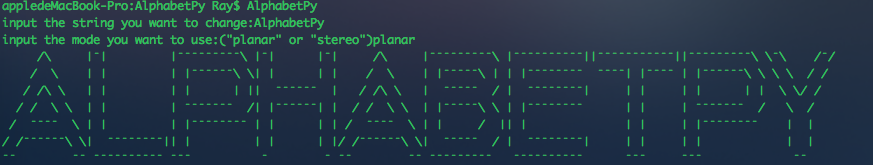
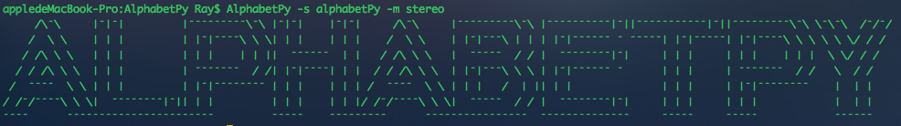

# alphabetPy


[](LICENSE.txt)
[](https://pypi.python.org/pypi/AlphabetPy/1.0)
[]()

A python tool to output characters in console/shell imitates starkwang's alphabetJS

> 此项目是我在使用[@starkwang](https://github.com/starkwang)的作品[alphabetJS](https://github.com/starkwang)时，感觉十分方便，于是将其翻译成python。由于对开源协议不是十分了解，如有侵权，请及时联系我加以修改。

> When I use [@starkwang](https://github.com/starkwang)'s project [alphabetJS](https://github.com/starkwang), I think it's very convenient. So I write it again in Python. Because I'm not familiar with LGPL, if there's any infringement, please contact me immediately and I'll do something to fix it. 

## Install

### 1.use `pip` to install it
`pip install AlphabetPy`

### 2.download this project and use `setup.py`
```shell
$ cd alphabetPy
$ python setup.py install
```

## Usage

After install `alphabetPy`, you can require it in shell:

```shell
$ AlphabetPy
input the string you want to change:<what you want to output>
input the mode you want to use:("planar" or "stereo"):<choose "planar" or "stereo">
```

for example:



you can also use the command:
`alphabetPy -s <what you want to output> -m <choose "planar" or "stereo">`

for example:



if you don't use the `-m`, it's be use mode "planar" to output the characters.

if you want to use `alphabetPy` in your own project, you can import `alphabetPy`:

for example:

```python
import AlphabetPy
string = "AlphabetPy"
letter = AlphabetPy.getAlphabet("233","stereo")
for i in range(7):
	print(letter[i])
```
Then you'll see the outputs in shell.

However, I think my code is stupid which make us cannot print letter directly. Maybe I'll improve my code someday.

## License
### The MIT License (MIT)

CopyRight (c) 2018 Ray Zhao &lt;<a href="rayzhao98@163.com">rayzhao98@163.com</a>&gt;

Permission is hereby granted, free of charge, to any person obtaining a copy
of this software and associated documentation files (the "Software"), to deal
in the Software without restriction, including without limitation the rights
to use, copy, modify, merge, publish, distribute, sublicense, and/or sell
copies of the Software, and to permit persons to whom the Software is
furnished to do so, subject to the following conditions:

The above copyright notice and this permission notice shall be included in
all copies or substantial portions of the Software.

THE SOFTWARE IS PROVIDED "AS IS", WITHOUT WARRANTY OF ANY KIND, EXPRESS OR
IMPLIED, INCLUDING BUT NOT LIMITED TO THE WARRANTIES OF MERCHANTABILITY,
FITNESS FOR A PARTICULAR PURPOSE AND NONINFRINGEMENT. IN NO EVENT SHALL THE
AUTHORS OR COPYRIGHT HOLDERS BE LIABLE FOR ANY CLAIM, DAMAGES OR OTHER
LIABILITY, WHETHER IN AN ACTION OF CONTRACT, TORT OR OTHERWISE, ARISING FROM,
OUT OF OR IN CONNECTION WITH THE SOFTWARE OR THE USE OR OTHER DEALINGS IN
THE SOFTWARE.

